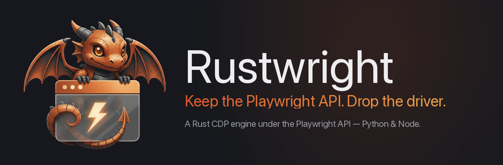

<div align="center">



**Change one import and your existing Playwright code — Python or Node — runs on an in-process Rust CDP engine. No Node driver subprocess. No Playwright fingerprint.**

[](#project-status)
[](https://github.com/Skyvern-AI/rustwright/actions/workflows/test.yml)
[](LICENSE)
[](pyproject.toml)
[](node/)
[](#limitations)
[](https://discord.gg/fG2XXEuQX3)

</div>

---

## Change one import

Rustwright is a drop-in for existing Playwright code — in most cases the import is the only line that changes.

**Python**

```diff
- from playwright.sync_api import sync_playwright
+ from rustwright.sync_api import sync_playwright

  with sync_playwright() as p:
      browser = p.chromium.launch(headless=True)
      page = browser.new_page()
      page.goto("https://example.com")
      print(page.title())
      browser.close()
```

**Node.js**

```diff
- import { chromium } from 'playwright';
+ import { chromium } from 'rustwright';

  const browser = await chromium.launch();
  const page = await browser.newPage();
  await page.goto('https://example.com');
  console.log(await page.title());
  await browser.close();
```

**515/515** shared parity cases pass against real Playwright (growing suite; full behavioral parity in progress). `rustwright.async_api` mirrors Playwright's async API (concurrency notes in [Limitations](#limitations)).

Prefer not to touch imports at all? Python offers an opt-in shim — `rustwright.enable_playwright_compat()` — that redirects `import playwright...` to Rustwright at runtime.

> [!WARNING]
> **Alpha.** Chromium-only, built from source (PyPI/npm publishing is the top roadmap item). Need Firefox/WebKit or production maturity today? Use [`playwright-python`](https://github.com/microsoft/playwright-python). Full list: [Limitations](#limitations).

## What is Rustwright?

Rustwright is a browser automation library for Python and Node.js that keeps the Playwright API you already know but drives Chromium from a **native Rust engine** speaking raw [Chrome DevTools Protocol](https://chromedevtools.github.io/devtools-protocol/) — no driver subprocess in the path.

```text
playwright-python:  your code ──pipe──► Node driver (separate process) ──CDP──► Chromium
rustwright:         your code ────────────────── raw CDP ─────────────────────► Chromium
```

## Why Rustwright?

- **No Node driver subprocess.** `playwright-python` launches and pipes to a bundled Node driver. Rustwright's engine is native — the browser-control code runs in-process.
- **Raw CDP, in Rust.** A from-scratch async CDP client — not a wrapper around another automation library.
- **No Playwright automation fingerprint.** The driver never loads, so its signatures never appear. See [Signal hygiene](#signal-hygiene).
- **Trusted input by default.** Clicks and typing go through real CDP input events (`Input.dispatchMouseEvent`), not synthetic `element.click()` DOM calls. Untrusted DOM shortcuts are opt-in only.
- **Cross-origin iframes (OOPIF).** Auto-attaches out-of-process iframe targets with flattened CDP sessions and routes `frame_locator()` across origins.
- **One engine, two languages.** The same Rust core backs the Python and Node bindings.

## How it works

One Rust core — an async CDP client built on Tokio (WebSocket, with opt-in Unix-pipe transport) — talks to Chromium directly, and thin [PyO3](https://pyo3.rs) (Python) and [napi-rs](https://napi.rs) (Node) bindings expose it in-process. The two-line diagram above is the entire architecture.

## Install

No package is published yet — **publishing to PyPI and npm is the top roadmap item**; [star or watch the repo](https://github.com/Skyvern-AI/rustwright) to catch the release. Until then, Rustwright builds from source on Linux, macOS, and Windows with a [Rust toolchain](https://rustup.rs/) (1.85+).

**Python** (3.8+)

```bash
git clone https://github.com/Skyvern-AI/rustwright && cd rustwright
python -m venv .venv && source .venv/bin/activate
python -m pip install -U pip maturin
maturin develop --release               # compiles the Rust engine (~5 min on first build)
python -m rustwright install chromium   # fetch a Chromium build
```

Keep the virtual environment activated when running `maturin develop` — maturin can print a success message while installing nothing into a non-active environment. If `import rustwright` later raises `ModuleNotFoundError`, run `source .venv/bin/activate` and rerun `maturin develop --release`.

**Node.js** (experimental — contributors only for now)

```bash
cd rustwright/node
npm install
npm run build          # builds the native addon via napi-rs
```

The build produces a local package; consume it from another project with `npm install /path/to/rustwright/node` (or `npm link`). Only a subset of the API surface is bridged — see [Limitations](#limitations).

Already have a Chromium/Chrome binary? Point Rustwright at it with `RUSTWRIGHT_CHROMIUM`, `CHROME`, or `CHROMIUM`.

## Signal hygiene

Because Rustwright never loads Playwright's Node driver, it never emits the automation signatures that ship with it:

- **No Playwright driver signatures** — no `__playwright__binding__` / utility-world globals, no driver bootstrap. The backend reports `playwright_driver: "none"`.
- **No `Runtime.enable` on the default path** — a normal launch + navigate never enables the CDP Runtime domain, closing the `Runtime.enable` console-serialization leak behind `isAutomatedWithCDP`. (Console/page-error/binding opt-ins still enable it lazily — detectable by design.)
- **Headless identity normalized by default** — launches with `--disable-blink-features=AutomationControlled`, rewrites `HeadlessChrome/` → `Chrome/` in the UA and client hints, and installs a `navigator.webdriver` cleanup init script.

Local fingerprint runs — default Playwright failed webdriver/headless checks that Rustwright passed; these are local diagnostics, not a guarantee:

| Probe | Result |
|---|---|
| SannySoft | ✅ Clean |
| BrowserScan | ✅ Clean |
| DeviceAndBrowserInfo | ✅ Clean (after the Runtime-domain cleanup) |
| CreepJS | ⚠️ Detects headless |

> [!IMPORTANT]
> **Rustwright is not "undetectable."** It is not a CAPTCHA or Cloudflare bypass, and it is not fully CDP-invisible — it still uses CDP primitives (`Target.setAutoAttach`, init scripts, and lazy `Runtime.enable` for console event/pageerror event/binding opt-ins). The claim is narrow: **no Playwright-specific automation fingerprint**, plus baseline signal hygiene.

## Benchmarks

Rustwright does not headline a speed number yet: launch-facing claims are held to reproducible, isolated CI evidence (Testbox + capped Docker), which is not yet published. Two diagnostic runs exist today — a local dev-host run where Rustwright won 16/17 case means, and a hosted strict run with a narrower gap:

| Run | Cases | Rustwright | playwright-python | Speedup |
|---|---:|---:|---:|---:|
| Local dev host (warm browser, 5 iterations) | 17 | 5,256 ms | 13,418 ms | **2.55×** |
| Hosted strict run | 78 | — | — | **~1.37×** |

Treat both as diagnostics, not launch claims — neither is capped-Docker/CI evidence. Methodology: [`BENCHMARK.md`](BENCHMARK.md).

## Rustwright vs the alternatives

| | Rustwright | playwright-python | Puppeteer | Patchright |
|---|---|---|---|---|
| **API** | Playwright-shaped (Py + Node) | Official Python Playwright | JS/TS Puppeteer | Playwright drop-in fork |
| **Engine / transport** | Rust core, raw CDP | Python → Node driver | Node over CDP | Patched PW driver |
| **In-process engine (no driver subprocess)** | ✅ | ❌ bundled Node driver | ✅ Node is the runtime | ❌ Playwright-style driver |
| **Browsers** | Chromium only | Chromium, Firefox, WebKit | Chrome, Firefox | Chromium-based |
| **Default input** | Trusted CDP events | Browser-level | Browser / CDP | Playwright + stealth |
| **Cross-origin iframes** | OOPIF (alpha) | Mature | Frame APIs | Inherits Playwright |
| **Playwright fingerprint** | No | Yes | n/a | Patched |
| **Maturity** | 🟠 Alpha | 🟢 Mature | 🟢 Mature | 🟡 Focused fork |

Rustwright's lane: **a Rust CDP engine under the Playwright API, for Chromium.**

## Limitations

See [`LIMITATIONS.md`](LIMITATIONS.md) for detail.

- **Alpha** — API shape covered; full **behavioral** parity not yet proven.
- **Chromium only** — Firefox and WebKit error explicitly.
- **Node bindings are early** — a subset of the surface is bridged (`launch`, `newPage`, `goto`, `click`, `fill`, `title`, `textContent`, `evaluate`, `screenshot`, `close`); contexts, routing, tracing, and locators are Python-only for now.
- **Async concurrency (Python)** — the async API wraps the sync engine via threads; recommended for **≈≤25 concurrent workflows/process**, not high fan-out.
- **OOPIF** — residual gaps in non-main-frame `JSHandle` follow-ups and drag/screenshot/bounding-box.
- **Signal hygiene is partial** — 3 of 4 public fingerprint targets clean in local runs (CreepJS still detects headless). **No undetectability promise.**

## Roadmap

- [ ] **Publish to PyPI and npm** — top priority
- [ ] CI / Testbox-backed benchmark evidence
- [ ] Native async engine (remove the Python thread-pool bridge)
- [ ] Broaden the Node.js surface (contexts, routing, locators)
- [ ] Close remaining OOPIF gaps
- [ ] Split the core into maintainable modules

Recently shipped:

- [x] OOPIF auto-attach with flattened CDP sessions
- [x] 515/515 shared parity suite green against real Playwright
- [x] `Runtime.enable` console-serialization leak closed on the default path

Firefox and WebKit are **not planned** — Rustwright is deliberately Chromium-only.

## Contributing

Rustwright is Rust + Python + Node. `cargo` builds the engine; `maturin develop --release` installs the Python package; `cd node && npm run build` builds the Node addon; the Python suite exercises the engine against real Chromium. Full Docker gate: **1,046 tests pass** (6 skipped), plus **515/515** shared parity cases run against real Playwright; CI (`test.yml`) runs a fast representative subset on every PR.

See [`CONTRIBUTING.md`](CONTRIBUTING.md) for build details and the code-layout reality.

## Project status

Rustwright is an early alpha from [Skyvern](https://github.com/Skyvern-AI), developed in the open. If the architecture resonates, [give it a ⭐](https://github.com/Skyvern-AI/rustwright).

Questions, ideas, or want to help? Join the Skyvern community on [**Discord**](https://discord.gg/fG2XXEuQX3).

## License

[MIT](LICENSE) © 2026 Ikonomos Inc (dba Skyvern)

<div align="center">
<sub>Built with 🦀🐉 and a lot of CDP frames · <a href="https://github.com/Skyvern-AI/rustwright">Skyvern-AI/rustwright</a></sub>
</div>
